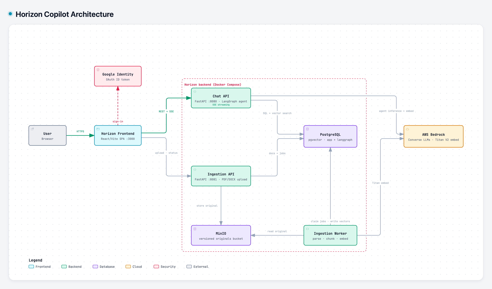

# Horizon Copilot

Horizon Copilot is a chat assistant for **Horizon Europe** work: programmes, projects, proposals, work
packages, deliverables and funding. Users sign in with Google, upload their own project documents (PDF or
Word), and ask questions. Answers about named projects or specific documents are grounded in the user's
indexed documents and cite the file, page or section they came from; answers stream to the browser as they
are written, and every attempt is stored durably so a dropped connection can be recovered.

**Documentation: start at [`docs/README.md`](docs/README.md)** (overview, architecture, guides, API and
configuration references, operations).

[](docs/architecture/horizon-copilot-arch-diagram.png)

## Repository structure

```text
.
├── docs/                  Engineering manual (index: docs/README.md) and the architecture diagram
├── services/
│   ├── chat/              Chat API (FastAPI): conversations, SSE turns, the Horizon agent, retention
│   ├── ingestion/         Upload API and always-on worker: extract, chunk, embed, publish documents
│   ├── migrations/        One-shot job: Alembic + LangGraph checkpoint schema; SQL provisioning and grants
│   └── frontend/          React/Vite single-page app, served by nginx in its image
├── libs/                  Shared Python libraries: config, genai, google-identity, observability, schema
├── config/                Layered YAML policy: base, per environment, per service
├── dev/
│   ├── stack/             Local Collector, Alloy, Grafana dashboards, Postgres/MinIO provisioning, runbook, telemetry canary
│   └── data/              A sample document for trying the system
├── scripts/               quality.sh and per-member mypy runner
├── openspec/              Spec-driven change records (proposal, design, specs, tasks)
├── .github/workflows/     CI: Python quality and integration, frontend, Docker builds
├── compose.yaml           The local stack: database, object store, services, telemetry
├── pyproject.toml         uv workspace, tool configuration and import-boundary contracts (uv.lock, .python-version pin the toolchain)
├── conftest.py            Shared integration-test fixtures (disposable database)
├── .pre-commit-config.yaml  Commit and push hooks
├── .env.example           Inputs for the local stack
└── TODO.md                Open engineering items
```

## Get started

**Run the whole system locally** (needs Docker with Compose v2.20+, a public Google OAuth client ID whose
authorized origin is `http://localhost:3000`, and AWS credentials with Amazon Bedrock access):

```zsh
cp .env.example .env     # set GOOGLE_CLIENT_ID, MAIN_MODEL_ID, UTILITY_MODEL_ID and the AWS credentials
docker compose up --build -d
```

Then open <http://localhost:3000>. Wait for readiness, verify, and learn what each container does in
[Local deployment](docs/guides/local-deployment.md); check a working system end to end with the
[smoke test](docs/guides/smoke-test.md).

**Work on the code** (Python 3.13.16 and uv 0.12.13; Node 24 for the frontend):

```zsh
uv sync --locked --all-packages
scripts/quality.sh       # lock freshness, Ruff, import boundaries, strict mypy, hermetic tests
```

Frontend checks run separately (`npm ci` and `npm run check` in `services/frontend`). How to run the
integration and browser suites, add a setting, an endpoint or a migration:
[Testing](docs/guides/testing.md), [Development](docs/guides/development.md).

## Where to look next

- Call the APIs: [API reference](docs/reference/api.md) and [Authentication](docs/guides/authentication.md).
- Configure it: [Configuration reference](docs/reference/configuration.md).
- Something is wrong: [Troubleshooting](docs/operations/troubleshooting.md).

Continuous integration runs on GitHub Actions; the required-check names and the pending branch-protection
setup are described in [Testing → CI](docs/guides/testing.md#ci) and tracked in [`TODO.md`](TODO.md).
